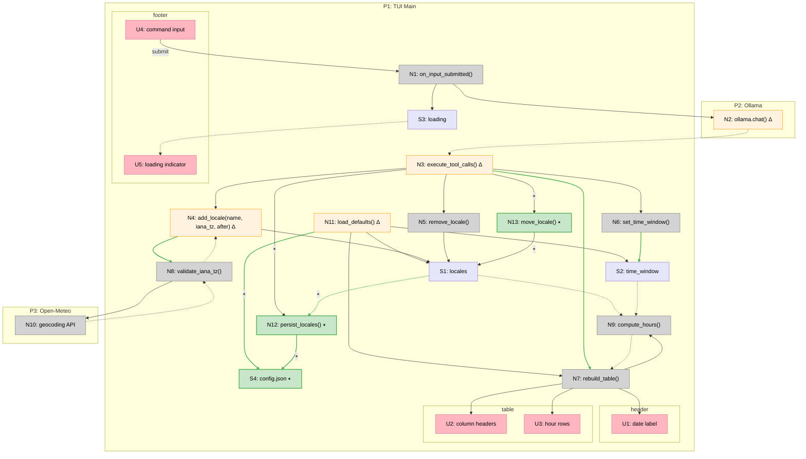
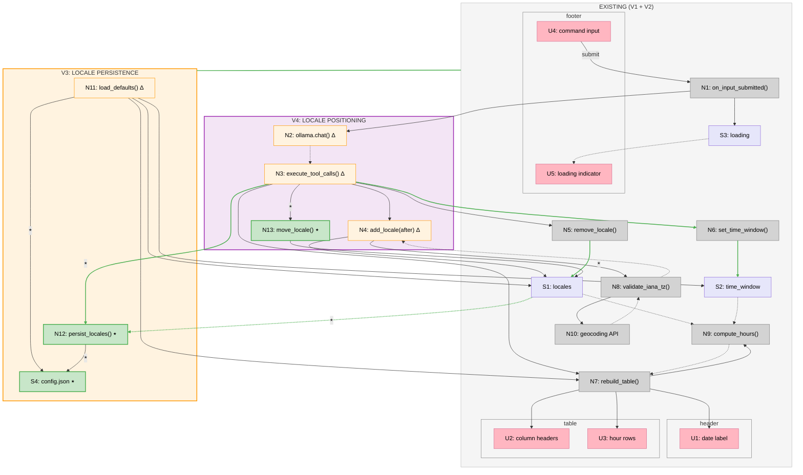

*This document was generated by Claude Code.*

# Tick — Shaping (v1.2)

A TUI app that shows a table of hours across time zones, with an LLM-driven input for modifying the view.

---

## Frame

### Problem

- Coordinating across time zones is mentally taxing — you have to look up offsets, do math, and remember DST rules
- Time zone offset data can be stale if hardcoded (DST changes, political changes to tz rules)
- Existing tools don't let you naturally say "show me Feb 12 in Brasil" — they require manual configuration

### Outcome

- User sees a clear hour-by-hour table across multiple time zones at a glance
- Time zone data is always accurate (IANA tz database via local library, DST-aware)
- User can naturally instruct the app via text to add/remove locales and change the time window

---

## Requirements (R)

| ID | Requirement | Status |
|----|-------------|--------|
| R0 | Show a table: rows = hours, columns = locales, cells = local time | Core goal |
| R1 | Time zone offsets and DST rules must be accurate (use IANA tz database via local library) | Must-have |
| R2 | Accept locale names in natural form (e.g. "Detroit", "Brasil", "Poland") and resolve to tz offsets | Must-have |
| R3 | Support a configurable list of default time zones that are always loaded | Must-have |
| R4 | Default time window is "today" — all 24 hours of the selected day | Must-have |
| R5 | LLM-driven input field at the bottom of the TUI for natural language commands | Must-have |
| R6 | LLM can add/remove locale columns via tool calls | Must-have |
| R7 | LLM can change the time window (e.g. "today", "feb 12", "next tuesday") via tool calls | Must-have |
| R8 | Screen reloads/refreshes to reflect changes after LLM commands | Must-have |
| R9 | Runs as a TUI (terminal UI) | Must-have |
| R10 | Uses a local LLM (simple, lightweight) | Must-have |
| R11 | A single input command can combine actions — change time window and add/remove locales together (e.g. "feb 12 in brasil") | Must-have |
| R12 | Adding/removing locales immediately persists as the new defaults for next launch | Must-have |
| R13 | Time window (selected day) is never persisted — always defaults to today on load | Must-have |
| R14 | Locale columns have a defined order and are reorderable | Must-have |
| R15 | Natural language input can specify where to place a locale in the column order (e.g. "add Tokyo after Detroit"), combinable with other instructions | Must-have |

---

## A: Python TUI with Ollama-driven tz resolution + local tz library

LLM does double duty: handles natural language commands AND resolves locale names to IANA identifiers. Local tz library handles all time computation. Python + Textual for the TUI, Ollama + Qwen2.5-3B for the LLM.

| Part | Mechanism | Flag |
|------|-----------|:----:|
| **A1** | **TUI shell** — Textual app with three regions: a `Label` (top) showing the current date ("Feb 7, 2026"), a `DataTable` (middle) showing the hour grid, and an `Input` (bottom) for typing commands. The date label is always visible so the user sees which day the table represents. App holds state: `locales: list[{name, iana_tz}]`, `time_window: date`, `hours: range`. On state change, updates date label and rebuilds table via A3. | |
| **A2** | **Local tz library** — `zoneinfo.ZoneInfo(iana_tz)` creates timezone objects. `datetime.now(tz)` and `datetime(y,m,d,h, tzinfo=tz)` compute local times. `zoneinfo.available_timezones()` provides the ~590 valid IANA identifiers for validation. | |
| **A3** | **Hour table builder** — Iterates 24 hours for `time_window` date. For each hour, creates a UTC datetime, converts to each locale's timezone via `dt.astimezone(tz)`, formats as `"3:00 PM"`. Returns list of rows, each row is a list of formatted time strings. Columns are locale names. | |
| **A4** | **Default config** — `DEFAULTS` dict mapping display names to IANA identifiers, e.g. `{"Detroit": "America/Detroit", "London": "Europe/London"}`. Used as seed when no persisted config exists. | |
| **A5** | **LLM input handler** — On `Input.Submitted`, sends user text to `ollama.chat('qwen2.5:3b', messages=[system_prompt, user_msg], tools=[add_locale, remove_locale, set_time_window, move_locale])`. System prompt instructs: "Parse commands into tool calls. Resolve locale names to IANA identifiers. Support positioning with `after` param." Returns `response.message.tool_calls` list to A6. Async call so TUI stays responsive (~1-2s). | ⚠️ |
| **A6** | **Tool executor** — Loops over tool calls from A5. `add_locale(name, iana_tz, after)`: validates tz, inserts after named locale (or appends). `remove_locale(name)`: removes matching entry. `move_locale(name, after)`: reorders existing locale. `set_time_window(date)`: parses ISO date string. After all calls processed, persists locales via A7 (if any locale mutation occurred), then triggers rebuild. If `iana_tz` validation fails, falls back to Open-Meteo geocoding API. | ⚠️ |
| **A7** | **Config persistence** — `~/.config/tick/config.json` stores the ordered locales list as `[{name, iana_tz}, ...]`. `load_defaults()` reads from file; if absent, seeds from A4 DEFAULTS and writes. After any locale mutation (add/remove/move), writes current `locales` to file. Time window is never persisted. | ⚠️ |
| **A8** | **Locale positioning** — `add_locale` gains optional `after` parameter (locale name to insert after; omit to append). New `move_locale(name, after)` tool moves an existing locale to after the named locale (`after=null` → move to first). LLM system prompt updated to describe positioning. | ⚠️ |

---

## Fit Check (R × A)

| Req | Requirement | Status | A |
|-----|-------------|--------|---|
| R0 | Show a table: rows = hours, columns = locales, cells = local time | Core goal | ✅ |
| R1 | Time zone offsets and DST rules must be accurate (use IANA tz database via local library) | Must-have | ✅ |
| R2 | Accept locale names in natural form (e.g. "Detroit", "Brasil", "Poland") and resolve to tz offsets | Must-have | ✅ |
| R3 | Support a configurable list of default time zones that are always loaded | Must-have | ✅ |
| R4 | Default time window is "today" — all 24 hours of the selected day | Must-have | ✅ |
| R5 | LLM-driven input field at the bottom of the TUI for natural language commands | Must-have | ✅ |
| R6 | LLM can add/remove locale columns via tool calls | Must-have | ✅ |
| R7 | LLM can change the time window (e.g. "today", "feb 12", "next tuesday") via tool calls | Must-have | ✅ |
| R8 | Screen reloads/refreshes to reflect changes after LLM commands | Must-have | ✅ |
| R9 | Runs as a TUI (terminal UI) | Must-have | ✅ |
| R10 | Uses a local LLM (simple, lightweight) | Must-have | ✅ |
| R11 | A single input command can combine actions — change time window and add/remove locales together (e.g. "feb 12 in brasil") | Must-have | ✅ |
| R12 | Adding/removing locales immediately persists as the new defaults for next launch | Must-have | ✅ |
| R13 | Time window (selected day) is never persisted — always defaults to today on load | Must-have | ✅ |
| R14 | Locale columns have a defined order and are reorderable | Must-have | ✅ |
| R15 | Natural language input can specify where to place a locale in the column order (e.g. "add Tokyo after Detroit"), combinable with other instructions | Must-have | ✅ |

All requirements pass with A5–A8 changes. A5, A6 modified; A7, A8 new — all four ⚠️ flagged (not yet built).

---

## Detail A: Breadboard

### Places

| # | Place | Description |
|---|-------|-------------|
| P1 | TUI Main | The single-screen TUI: date label, hour table, command input |
| P2 | Ollama | Local LLM service (external process) |
| P3 | Open-Meteo | Geocoding fallback API (external) |

### UI Affordances

| # | Place | Component | Affordance | Control | Wires Out | Returns To |
|---|-------|-----------|------------|---------|-----------|------------|
| U1 | P1 | header | date label ("Feb 7, 2026") | render | — | — |
| U2 | P1 | table | column headers (locale names) | render | — | — |
| U3 | P1 | table | hour rows (formatted local times) | render | — | — |
| U4 | P1 | footer | command input | type + submit | → N1 | — |
| U5 | P1 | footer | loading indicator ("Thinking...") | render | — | — |

### Code Affordances

| # | Place | Component | Affordance | Control | Wires Out | Returns To | v1.2 |
|---|-------|-----------|------------|---------|-----------|------------|:----:|
| N1 | P1 | app | `on_input_submitted()` | call | → N2, → S3 | — | |
| N2 | P2 | ollama | `ollama.chat(model, messages, tools)` | call | — | → N3 | **Δ** |
| N3 | P1 | app | `execute_tool_calls(tool_calls)` | call | → N4, → N5, → N6, → N13 | → N12, → N7 | **Δ** |
| N4 | P1 | app | `add_locale(name, iana_tz, after)` | call | → N8 | → S1 | **Δ** |
| N5 | P1 | app | `remove_locale(name)` | call | — | → S1 | |
| N6 | P1 | app | `set_time_window(date)` | call | — | → S2 | |
| N7 | P1 | app | `rebuild_table()` | call | → N9 | → U1, → U2, → U3 | |
| N8 | P1 | app | `validate_iana_tz(iana_tz)` | call | → N10 | → N4 | |
| N9 | P1 | app | `compute_hours(locales, time_window)` | call | — | → N7 | |
| N10 | P3 | open-meteo | `geocoding-api.open-meteo.com/v1/search` | call | — | → N8 | |
| N11 | P1 | app | `load_defaults()` | call | → S4 | → S1, → S2, → N7 | **Δ** |
| N12 | P1 | app | `persist_locales()` | call | → S4 | — | **NEW** |
| N13 | P1 | app | `move_locale(name, after)` | call | — | → S1 | **NEW** |

### Data Stores

| # | Place | Store | Description | v1.2 |
|---|-------|-------|-------------|:----:|
| S1 | P1 | `locales` | `list[{name: str, iana_tz: str}]` — active locale columns | |
| S2 | P1 | `time_window` | `date` — the day being displayed | |
| S3 | P1 | `loading` | `bool` — whether LLM call is in progress | |
| S4 | P1 | `config.json` | `~/.config/tick/config.json` — persisted ordered locale list | **NEW** |

### Wiring Narrative

**Startup flow (Δ v1.2):** `N11 load_defaults()` reads `S4` config file → if present, loads locales to `S1`; if absent, seeds from A4 DEFAULTS and writes to `S4` → sets today's date to `S2` → calls `N7 rebuild_table()` → `N9 compute_hours()` uses `zoneinfo` to convert each hour to each locale's timezone → `N7` updates `U1` (date label), `U2` (column headers), `U3` (hour rows).

**Command flow (Δ v1.2):** User types in `U4` → submit fires `N1` → sets `S3` loading (shows `U5`) → calls `N2` Ollama with tools (now includes `move_locale`, `after` param on `add_locale`) → LLM returns tool calls → `N3` loops them: `N4` adds locale at position (validates via `N8`, falls back to `N10`), `N5` removes locale, `N13` moves locale, `N6` sets date → after all calls, if any locale mutation occurred, `N3` calls `N12 persist_locales()` which writes `S1` to `S4` → then `N3` calls `N7` rebuild → table updates.

### Mermaid

**Legend:**
- **Pink nodes (U)** = UI affordances (things users see/interact with)
- **Grey nodes (N)** = Code affordances (methods, handlers, services)
- **Lavender nodes (S)** = Data stores (state)
- **Orange nodes (Δ)** = Modified in v1.2
- **Green nodes (⭑)** = New in v1.2
- **Solid lines** = Wires Out (calls, triggers, writes)
- **Dashed lines** = Returns To (return values, data reads)
- **Green lines** = New wires in v1.2

---

## Slices

### Slice Summary

| # | Slice | Parts | Demo |
|---|-------|-------|------|
| V3 | Locale persistence | A7, A6 (persist wiring) | "Add Brasil, quit, relaunch — Brasil is still there" |
| V4 | Locale positioning | A8, A5 (tool defs), A6 (move dispatch + after param) | "Type 'add Tokyo after Detroit' — Tokyo appears between Detroit and London" |

V3 before V4 — persistence lands first. When V4 adds `move_locale`, the persist mechanism already captures the new order because it just writes S1.

### V3: Locale persistence

| # | Component | Affordance | Control | Wires Out | Returns To | v1.2 |
|---|-----------|------------|---------|-----------|------------|:----:|
| N11 | app | `load_defaults()` | call | → S4, → S1, → S2, → N7 | — | **Δ** |
| N3 | app | `execute_tool_calls(tool_calls)` | call | → N4, → N5, → N6, → N12 | → N7 | **Δ** |
| N12 | app | `persist_locales()` | call | → S4 | — | **NEW** |
| S4 | app | `config.json` | store | — | → N11 | **NEW** |
| S1 | app | `locales` | store | — | → N12 | |

### V4: Locale positioning

| # | Component | Affordance | Control | Wires Out | Returns To | v1.2 |
|---|-----------|------------|---------|-----------|------------|:----:|
| N2 | ollama | `ollama.chat(model, messages, tools)` | call | — | → N3 | **Δ** |
| N3 | app | `execute_tool_calls(tool_calls)` | call | → N13 | → N7 | **Δ** |
| N4 | app | `add_locale(name, iana_tz, after)` | call | → N8 | → S1 | **Δ** |
| N13 | app | `move_locale(name, after)` | call | — | → S1 | **NEW** |

### Sliced Breadboard

**Legend:**
- **Grey boundary** = Existing (V1 + V2) — already built
- **Orange boundary (V3)** = Locale persistence — config file read/write
- **Purple boundary (V4)** = Locale positioning — after param, move_locale, LLM tool defs
- **Orange nodes (Δ)** = Modified in v1.2
- **Green nodes (⭑)** = New in v1.2
- **Green lines (⭑)** = New wires in v1.2

---

## Decisions needed

1. ~~**Language/framework for TUI**~~ — **Resolved.** Python + Textual.

2. ~~**Time zone data source (A2)**~~ — **Resolved.** LLM resolves names → IANA identifiers. Local `zoneinfo` computes times. Open-Meteo geocoding as fallback.

3. ~~**Local LLM runtime (A5)**~~ — **Resolved.** Ollama + `qwen2.5:3b` (~2GB). Python `ollama` library.

4. ~~**Tool call protocol (A5/A6)**~~ — **Resolved.** Ollama native tool calling. Define Python functions with type annotations, Ollama auto-generates JSON schema, returns structured `tool_calls` in response.
